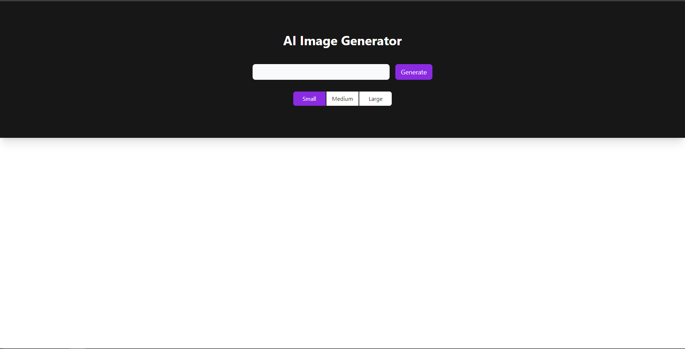
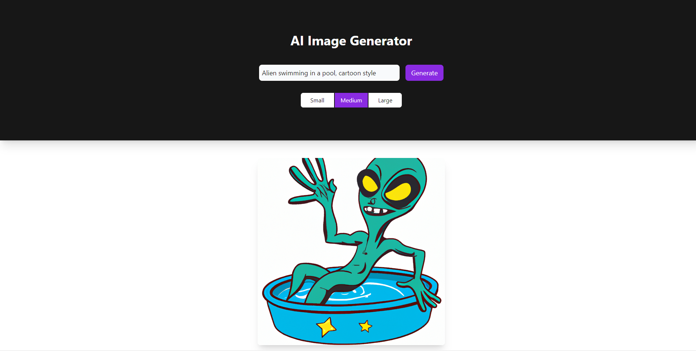
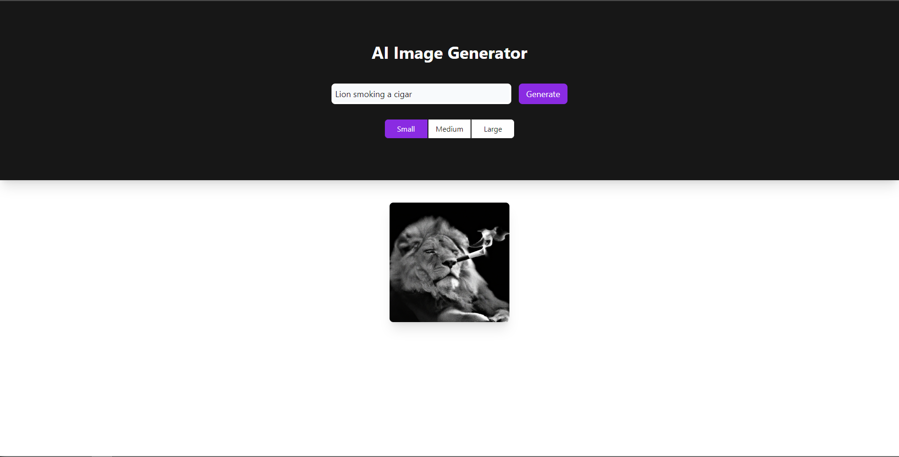
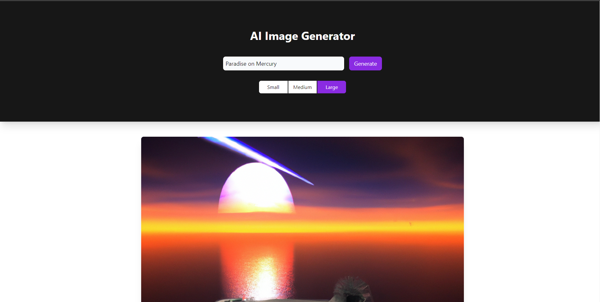

# AI Image Generator

This is a full-stack app that leverages artificial intelligence to generate images based on user prompts. It utilizes Open AI's DALL E API to generate custom & original images.

## Generating an Image
To generate an image, you must first write a prompt and select a size. The DALL E API has no boundaries (other than offensive topics), so don't be afraid to use your imagination. Here are a few examples:

## Technologies Used
- Next.js / React.js
- TypeScript
- Tailwind CSS
- Axios
- Node,js / Express.js
- DALL E API
